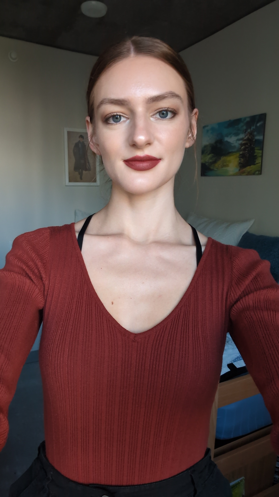

# Hello, I'm Sasha!



## **About Me**
I am a third year Mathematics-Computer Science major at UCSD. I graduated with an associate's degree in Mathematics from West Valley College. Although I have done little in terms of programming projects outside of course material I am very passionate about programming and chose this field because of my interest in it. Outside of computer science I enjoy hobbies such as reading, gaming, and baking.

## Sections:
[Languages I know](#languages-i-know)  
[Top 3 reads from last year](#top-3-reads-from-last-year)  
[Favorite quote](#favorite-quote)  
[Inspirational code](#inspirational-code-xd)  
[Goals](#goals)  
[More about me](#more-about-me)  

### *Languages I know*
- Python
- C
- C++
- Java
- ARMv8

### *Top 3 reads from last year*
1. The Song of Achilles
2. Beyond Words
3. The Land of Lost Things

### *Favorite quote*
> Doing the right thing is never a waste of time.

### *Inspirational code XD*
```
if(youWant()==true) {
    youCan();
} else {youCant();}
```
### *Goals*
- [X] Associate's degree
- [ ] Bachelor's degree
- [ ] Internships
- [ ] A great job

### *More about me*
[More pictures](/pictures.md)   
[I stream games for fun!](https://www.twitch.tv/lady_art3miss)